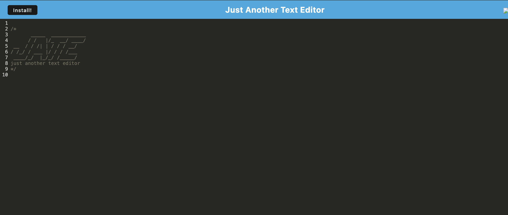

# JATE-19



## Link
https://jate-19-1z7t.onrender.com/

## Description
This is a text editor web application that follows a client-server architecture and is bundled using Webpack. It includes IndexedDB for persistent storage and supports Progressive Web Application (PWA) functionality.

## Installation
1. Clone the repository:
   ```sh
   git clone <repository-url>
   ```
2. Navigate to the project directory:
   cd text-editor-app

3. Install dependencies:
   ```sh
   npm install
   ```

## Usage
To start the application, run:
```sh
npm run start
```
This command starts both the backend server and serves the client application.

## Features
The application meets the following acceptance criteria:

- **Application Structure**: Upon opening the project, a client-server folder structure is present.
- **Start-up Process**: Running `npm run start` from the root directory starts both the backend and client.
- **Webpack Bundling**: JavaScript files are bundled using Webpack.
- **Webpack Plugins**: Generates an HTML file, service worker, and manifest file.
- **Next-Gen JavaScript Support**: Ensures compatibility and error-free execution in the browser.
- **IndexedDB Integration**: Automatically creates a database for persistent storage.
- **Data Persistence**:
  - Content is saved when the user clicks away from the window.
  - Content is retrieved when reopening the text editor.
- **PWA Installation**: The application can be installed as a desktop icon.
- **Service Worker Registration**:
  - A service worker is registered using Workbox.
  - Static assets are pre-cached upon loading.
- **Deployment**: Proper build scripts are included for deployment to Render.

## Deployment
The application is configured for deployment on Render. Ensure proper environment setup and follow the deployment instructions provided by Render.
